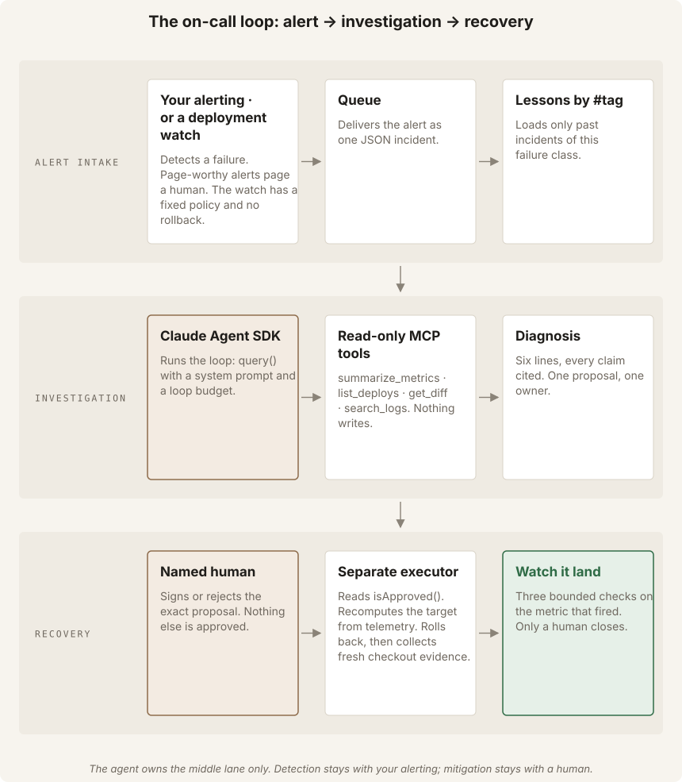
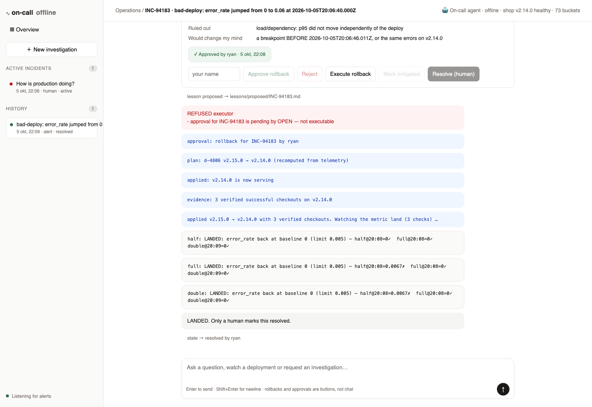
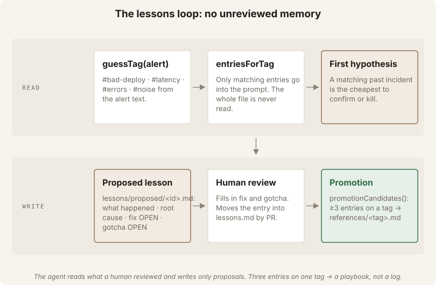
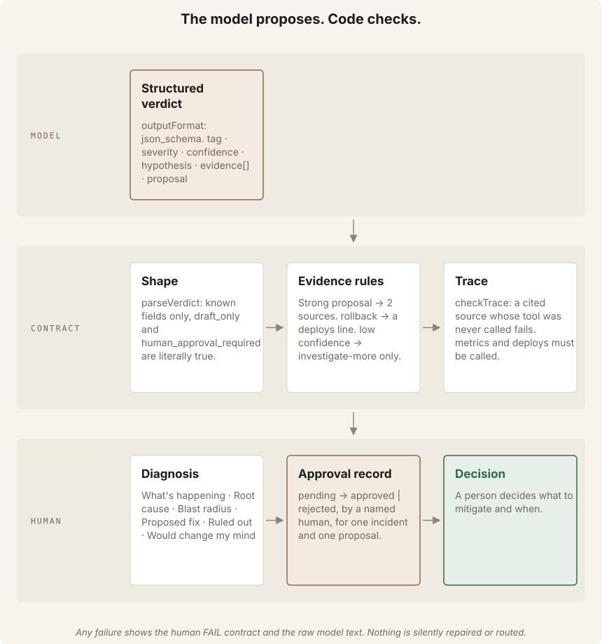

# AI SRE first responder on the Claude Agent SDK

An alert fires. The agent reads the lessons for that failure class, then calls
`summarize_metrics`, `list_deploys`, `get_diff` when a deploy lines up, and
`search_logs`. It posts one diagnosis with a reference behind every claim and
one proposed next step. A human decides. After the human acts, the agent
watches the metric and reports whether it returned to baseline.

The agent **cannot** roll back, scale, flip a flag or page anyone. That is
not a missing feature. It is the design, taken from
[`anthropics/oncall-kit`](https://github.com/anthropics/oncall-kit):
*the agent gathers evidence, proposes, verifies and communicates; humans
decide what to mitigate and when.*

You can run the whole project offline. The offline runtime is a scripted
investigator that runs the same tools against the same fixtures. Its output
demonstrates the pipeline; it is not model evidence.

Follow **[SOLO.md](SOLO.md)** for the ten-step tutorial, numbered 0–9. This
README is the reference.



Four diagrams explain the design. They live in `docs/diagrams/`. Rebuilding
them with `npm run diagrams` is optional and not part of the tutorial.
A five-minute narrated explainer is at `docs/video/explainer.mp4`.
Rebuilding the video is optional. It needs `edge-tts` or macOS `say`.

## Set up

```
git clone <this repo>
cd sre-oncall-agent
npm ci
npm run fixtures
npm run check
```

`npm run check` runs typecheck, tests, the bench ratchet, the course check,
and two offline investigations. It ends with `PASS check`.

## Works on

Use Node.js 22.13 or later. Node 22.13 includes unflagged `node:sqlite`.
The commands work on macOS, Linux, Windows PowerShell, and Windows cmd.

## The loop, in five commands

```
npm run investigate -- fixtures/incidents/bad-deploy.json          # 1 · diagnose, draft an approval, propose a lesson
npm run approve     -- fixtures/incidents/bad-deploy.json --by "Solo Learner"  # 2 · a NAMED human signs (or: npm run reject)
#                                                                    # 3 · a human (or a separate gated system) applies the fix
npm run watch       -- fixtures/incidents/bad-deploy.json --metric error_rate --fix-at 2026-10-05T03:52:00Z --after fixtures/telemetry/after-rollback.json # 4 · three bounded checks
#                                                                    # 5 · review lessons/proposed/INC-1001.md → PR into lessons/lessons.md
```

Add `--dry-run` to step 1 to skip the approval draft and the lesson proposal.

## The console: a local on-call desk with a chat

Run `npm run shop` and `npm run traffic` in separate terminals. Then start
`npm run console`. Open `http://localhost:4320` for the offline investigator.

To use a real model, set `AGENT_MODEL` before starting the console.

macOS or Linux:

```sh
export AGENT_MODEL=sonnet
npm run console
```

PowerShell:

```powershell
$env:AGENT_MODEL = "sonnet"
npm run console
```

cmd:

```bat
set AGENT_MODEL=sonnet
npm run console
```



Everything runs locally: Node `http`, `node:sqlite`, one HTML file, the
Claude **Agent SDK** (not Managed Agents). The console is the three intake
paths from Anthropic's figure landing in one triage loop:

| Path | How it reaches the console |
| --- | --- |
| **Alert** | your alerting `POST /api/alerts {"alert": "…"}` — or the built-in **listener**: every 10 s it evaluates `oncall.md`-style criteria on the live telemetry (error_rate > 2% or p95 > 2000 ms, sustained, deploy-window aware) and opens an incident. Deterministic. The agent is never the detector. |
| **Human report** | "+ New investigation", or type `Investigate: customers report checkout errors` |
| **Deployment watch** | type `Watch the next deployment for five minutes.` — a failed watch opens an incident |

The chat box is routed by a grammar before any model sees it
(`src/chat.ts`): watch commands → the watcher; `Investigate: …` → the full
loop; a free question → the investigator in read-only Q&A mode (no
proposal); and **anything that sounds like a mutation — "roll back",
"approve", "resolve" — is refused**: those are buttons a named human clicks.
Incidents move through `active → stale → mitigated → resolved`; every arrow
into a closed state is a button with a name field, and the agent may only
flag *stale*.

## The live demo: a shop you can break

Fixtures are good for the tutorial. To see the agent react to something
*happening*, run the demo shop — a tiny checkout service with fault
injection that writes its own telemetry in the shape the agent reads.

```
npm run demo                      # whole loop on a bad deploy, ~2 min: shop → traffic → fault → investigate → refused → approve → execute → LANDED
npm run demo -- slow degrade      # latency with NO deploy record → agent proposes scale, executor refuses (not a rollback)
npm run demo -- errors degrade    # mystery 5xx, no deploy → investigate-more, low confidence
npm run demo:watch                # "Watch the next deployment for one minute." with a bad deploy injected mid-watch → FAILED, incident queued, no rollback
```

Or drive it by hand in three terminals:

```
npm run shop                                           # :4310, telemetry → demo/data/telemetry.json
npm run traffic                                        # 8 checkouts/s
npm run chaos -- deploy v2.15.0 --mode bad-deploy      # faults: healthy · bad-deploy · slow · errors
npm run chaos -- degrade --mode slow                   # same fault, no deploy record
npm run live -- --alert "Error rate 12% for 5 min on checkout" --out demo/incidents/live.json
npm run investigate -- demo/incidents/live.json
npm run approve -- demo/incidents/live.json --by you
npm run execute -- demo/incidents/live.json            # the SEPARATE executor: approval → recomputed target → rollback → 3 fresh verified checkouts
npm run watch-deploy -- "Watch the next deployment for five minutes."
npm run doctor                                         # preflight
```

The executor (`src/executor.ts`) is deliberately a different program from
the agent. It never reads model text: it re-derives the rollback target from
telemetry, refuses anything that is not an approved `rollback`, and reports
done only after three verified successful checkouts on the intended
revision. The deployment watch (`src/deployWatch.ts`) parses a strict
command grammar — extra sentences describing the fixed policy are accepted,
anything else is rejected rather than silently changing the rules — and
evaluates a fixed, model-free failure policy: three consecutive verified
failures, three consecutive >1000 ms, or ≥3 5xx since the watch began. An
unverified check breaks a streak. There is no automatic rollback.

## Run with a real model (optional)

Set the key in your shell only. Do not put it in a file.

macOS or Linux:

```sh
export ANTHROPIC_API_KEY=sk-ant-...
```

PowerShell:

```powershell
$env:ANTHROPIC_API_KEY = "sk-ant-..."
```

cmd:

```bat
set ANTHROPIC_API_KEY=sk-ant-...
```

Then run:

```text
npm run investigate -- fixtures/incidents/bad-deploy.json --dry-run --model sonnet
npm run e2e
```

The team runbook lives in `skills/triage/SKILL.md` — a Skill-shaped file,
loaded into the system prompt, editable like code, and uploadable unchanged
as a Claude Code or Managed Agents skill. Its order of operations is the
agent's method: read metrics, compare deploys with breakpoints, read
`get_diff` when a deploy lines up, then search logs to confirm.

The model gets the same four read-only tools through an in-process MCP
server, the same `lessons.md` slice, and the same JSON-schema output
contract. The offline run uses four tool turns and one answer turn. A run
costs a few cents. `--max-turns` and `--max-budget-usd` bound the loop.

## What the model can and cannot do

| Can | Cannot |
| --- | --- |
| `search_logs`, `summarize_metrics`, `list_deploys`, `get_diff` (read-only, capped) | call any tool that changes the system — none exists |
| read lessons for the matching `#tag` | read the whole `lessons.md` (grows unbounded by design) |
| propose `rollback` / `scale` / `flag-off` / `investigate-more` / `no-action` | execute any of them |
| write `lessons/proposed/<id>.md` | append to `lessons/lessons.md` |
| draft `approvals/<id>.approval.json` as *pending* | sign it — `decided_by` must be a named human |



## The contract (what code checks after the model answers)



- `evidence` has ≥1 line; each line is `logs:<ts>`, `metrics:<ts>`, `deploys:<id>`, `diff:<id>` or `lessons:<id>`.
- A strong proposal (`rollback`, `scale`, `flag-off`) needs **two sources**. One signal is a hunch.
- `rollback` needs a `deploys` line — you cannot undo a change you did not find.
- `low` confidence may only propose `investigate-more`.
- `summarize_metrics` and `list_deploys` must appear in the tool trace; a cited source whose tool was never called fails.
- `incident_id` must match the input. `draft_only` and `human_approval_required` are the literal `true`.

## Files

```
SOLO.md                       step-by-step tutorial
src/contract.ts               Incident · Verdict · Recommendation · schema · evidence rules
src/telemetry.ts              the fictional production system: logs, metrics, deploys (pure queries)
src/tools.ts                  the four read-only tools, as an in-process MCP server
src/prompts.ts                standing orders (ASD-STE100-ish) + the runbook from skills/triage/SKILL.md
skills/triage/SKILL.md        the team runbook as a Skill: order of operations, things that have burned us
src/e2e.ts                    headless real-model check (npm run e2e)
src/lessons.ts                lessons.md: read by #tag, propose-only writes, promotion candidates
src/agent.ts                  the query() loop, trace extraction, trace ↔ evidence check
src/router.ts                 parse → validate → attach owner
src/approval.ts               the approval record a human signs; isApproved() for executors
src/watch.ts                  "watch it land": baseline + three bounded checks
src/bench.ts                  held-out replay + ratchet
src/runtime.ts                real SDK or the offline scripted investigator
src/cli.ts                    investigate · approve · reject · watch
src/deployWatch.ts            "Watch the next deployment for N minutes": strict grammar, fixed failure policy, no model
src/executor.ts               the SEPARATE approved-recovery executor: approval → recomputed plan → rollback → fresh evidence
src/ops.ts                    doctor · live · watch-deploy · execute
src/chat.ts                   chat routing: grammar first, mutations refused, questions → read-only Q&A
src/store.ts                  incidents + messages in node:sqlite; four states, human-only closing arrows
console/server.ts             the local console: HTTP API, SSE, alert webhook, deterministic listener
console/index.html            the UI: sidebar, overview, incident chat, approve/execute/resolve buttons
demo/shop.ts                  the fictional checkout service with fault injection; writes telemetry.json
demo/chaos.ts                 traffic generator + deploy/degrade levers (the operator's, not the agent's)
demo/run.ts                   npm run demo — the whole loop live
demo/watch-demo.ts            npm run demo:watch — the live deployment watch
fixtures/generate.mjs         deterministic telemetry for six scenarios
fixtures/incidents/           the alerts, incl. adversarial + malformed
bench/cases.json              expected proposal + severity per scenario
bench/ratchet.json            the floor CI enforces (only goes up)
scripts/check.mjs             offline learner check
references/README.md          human promotion path for recurring patterns
docs/gate-step-9.md           named reviewer gate template for the tutorial
docs/solutions/step-9.md      reference solution for the learner's fork
docs/diagrams/                four SVG swimlane diagrams + the script that draws them
docs/video/                   the explainer video + the script that renders it
lessons/lessons.md            reviewed incident log (two seed entries)
lessons/proposed/             where the agent writes; humans promote
approvals/                    pending/approved/rejected records
.claude/agents/               the same investigator as a Claude Code subagent
course/                       interactive HTML course (open course/index.html)
docs/sources.md               what each idea was taken from
```

## What was added after comparing with the video's repo

Owain's `ai-sre-agent` has a demo shop, a chat-scheduled deployment watch
with a fixed failure policy, an approved-recovery executor that produces
fresh checkout evidence, and a `doctor`. The first version of this repo had
none of those — it only replayed fixtures. All four are now here (`demo/`,
`src/deployWatch.ts`, `src/executor.ts`, `npm run doctor`), with two
differences kept on purpose: the executor is a separate program the agent
cannot call, and the rollback target is recomputed from telemetry instead of
taken from the proposal. What is still not here: Pub/Sub intake, a web
console, Postgres persistence, and Cloud Run — those are deployment choices,
not design.

## Resources

Every idea in this repo has a primary source. Per-source "taken / deliberately not taken" is in [`docs/sources.md`](docs/sources.md).

### The video that started it
- Owain Lewis — [I Built A Claude DevOps Agent To Run My Software Factory](https://www.youtube.com/watch?v=l6GpUvPOVpM) (2026-10-05). The framing: agents are superhuman at searching data for one problem; humans decide; "watch the next deployment for N minutes".
- DevOps Toolkit — [Claude Code: AI Agent for DevOps, SRE, and Platform Engineering](https://www.youtube.com/watch?v=h-6LP133o6w). The wish for an agent that *watches* and notifies; bounded here as `watch`.

### Anthropic — the rules
- [`anthropics/oncall-kit`](https://github.com/anthropics/oncall-kit) (Apache-2.0, reference implementation) — read [`skills/triage/SKILL.md`](https://github.com/anthropics/oncall-kit/blob/main/skills/triage/SKILL.md) and [`CLAUDE.md`](https://github.com/anthropics/oncall-kit/blob/main/CLAUDE.md), not just the README. Never the detector · no auto-mitigation · no unreviewed memory · every claim linked · lessons by tag · the six-line diagnosis · rule 5a · rule 9 (three checks) · ≥70% / zero harmful.
- [Claude on call: how Claude Tag serves as Anthropic's first responder for CI/CD failures](https://claude.com/blog/ai-ci-cd-on-call) (2026-08-18) — `lessons.md` entry format; "query the data first, then theorize"; deterministic alerting, agentic triage.
- [Claude Tag on-call webinar](https://www.anthropic.com/webinars/claude-tag-on-call-a-new-teammate-in-your-incident-channel) — companion to the blog.
- [Claude Cookbook: Build an SRE incident response agent with Claude Managed Agents](https://platform.claude.com/cookbook/managed-agents-sre-incident-responder) ([notebook](https://github.com/anthropics/claude-cookbooks/blob/main/managed_agents/sre_incident_responder.ipynb)) — `request_approval` as a custom tool the application answers; Skills for runbook conventions. Live session: [Cooking with Claude](https://www.anthropic.com/webinars/cooking-with-claude-how-to-build-an-sre-incident-response-agent) (2026-06-25).
- [Agent SDK: the site-reliability agent](https://github.com/anthropics/claude-cookbooks/blob/main/claude_agent_sdk/03_The_site_reliability_agent.ipynb) — the same problem on the local SDK (the runtime this repo uses).
- [cwc-workshops: ship your first managed agent](https://github.com/anthropics/cwc-workshops/tree/main/ship-your-first-managed-agent) (MIT, workshop sample) — the runbook-as-Skill with an explicit order of operations and a "things that have burned us" list; `get_diff` as a tool (read the change before you blame it); `e2e.py` as a headless real-model check; the incident dashboard with the agent in a side panel.
- [How we made claude.ai 3x faster in two weeks](https://claude.dev/blog/how-we-made-claude-ai-faster/) (2026-09-23) — every benchmark is a CI guardrail with a one-way ratchet; prove a proxy tracks the real metric before climbing it.
- [`anthropics/code-migration-kit-with-claude-code`](https://github.com/anthropics/code-migration-kit-with-claude-code) — "you don't fix the code, you fix the process"; recurring failures indict a rule; ban by configuration, not by request.
- [Claude Agent SDK](https://docs.claude.com/en/docs/agent-sdk/overview) · [TypeScript SDK](https://github.com/anthropics/claude-agent-sdk-typescript) · [MCP in the SDK](https://code.claude.com/docs/en/mcp).

### Google SRE
- [AI in SRE: where and how Google is deploying agentic AI to improve operations](https://cloud.google.com/blog/products/devops-sre/how-google-sre-is-using-agentic-ai-to-improve-operations) (2026-05-28) and the whitepaper [AI in SRE Practice](https://goo.gle/4uUxy4y) — RCA is one area of several; playbooks improve from use; anomaly detection over static thresholds (→ the `noisy-alert` scenario).
- [SRE book](https://sre.google/sre-book/table-of-contents/) · [SRE workbook](https://sre.google/workbook/table-of-contents/) — the discipline the agent slots into.

### Base repo and writing
- [`RyanLisse/aetherlink-day5-n8n-to-agent`](https://github.com/RyanLisse/aetherlink-day5-n8n-to-agent) — the shape: contract → runtime port → trace → validate → route → memory; `Result` over `throw`; the SOLO.md format; the HTML course build.
- [ASD-STE100](https://www.asd-ste100.org/) — the controlled-language spec the prompts, `SOLO.md` and the narration aim at (~80%): short sentences, one instruction each, one term per thing.

## Safety

All data is fictional. Nothing is sent, deployed, rolled back, scaled or
paged. The agent has four read-only tools and no network. Every verdict has
`draft_only: true` and `human_approval_required: true`.
