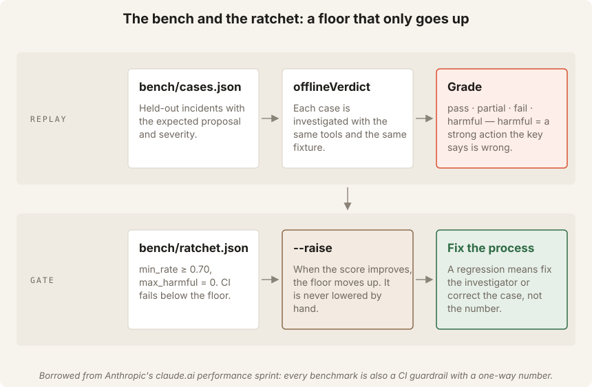

# Tutorial: build an AI SRE first responder

You can do this path alone. Each step has four parts: **Explain**, **See it**,
**Do**, **Check**. Everything runs offline. A real model run is optional and
needs your own API key.

| Step | You do | Time |
| --- | --- | --- |
| 0 | Install, generate the fixtures, run the suite | 5 min |
| 1 | Read the alert and the data the agent can see | 10 min |
| 2 | Run the first investigation and read the trace | 10 min |
| 3 | Break the evidence rules on purpose | 10 min |
| 4 | Sign the approval, then watch the fix land | 10 min |
| 5 | Review the proposed lesson and promote a pattern | 10 min |
| 6 | Run the bench, then try to lower the ratchet | 5 min |
| 7 | (Optional) Run with a real model | 5 min |
| 8 | Break a live shop and watch the whole loop | 10 min |
| 9 | Ship one change through the AI-native SDLC loop | 25 min |

## Works on

Use Node.js 22.13 or later. Node 22.13 includes unflagged `node:sqlite`.
Commands work in macOS and Linux shells, PowerShell, and cmd. The commands
in each step use the same syntax in all three.

Rebuilding diagrams is optional. Rebuilding the video is also optional and
needs `edge-tts` or macOS `say`.

---

## Step 0 — Install

**Explain:** The project is a TypeScript agent on the Claude Agent SDK with
four read-only tools and a scripted offline runtime.

**Do:**

```text
npm ci
npm run fixtures
npm run check
```

**Check:** `npm run fixtures` writes six files under `fixtures/telemetry/`.
`npm run check` ends with `PASS check`.

---

## Step 1 — What the agent can see


**Explain:** The agent gets an alert and four tools. It cannot change the
system. That is the whole design.

**See it:** Open `fixtures/incidents/bad-deploy.json` (the alert) and
`fixtures/telemetry/bad-deploy.json` (the system). Find the minute where
`error_rate` jumps and the deploy two minutes before it.

Open `src/tools.ts`. Count the tools. Try to find a tool that writes.

**Check:** Four tools: `search_logs`, `summarize_metrics`, `list_deploys`,
and `get_diff`. None writes. The deploy is `d-4821` at 03:43; errors start
at 03:45.

---

## Step 2 — The first investigation

**Explain:** `query()` runs a loop: the model asks for a tool, the SDK runs
it, the result goes back. `maxTurns` caps the loop. The trace records every
tool call so you can see WHAT the agent looked at before you read what it
concluded.

**See it:** `ONCALL_SYSTEM` in `src/prompts.ts` is the method: lessons →
metrics → deploys → `get_diff` when a deploy lines up → logs → verdict.
`investigate()` in `src/agent.ts` is the loop.

**Do:**

```text
npm run investigate -- fixtures/incidents/bad-deploy.json --dry-run
```

**Check:** The offline trace uses four tool turns and one answer turn. It
calls metrics, deploys, `get_diff` when a deploy lines up, then logs. The
diagnosis cites `metrics:<ts>`, `deploys:<id>`, `diff:<id>`, and
`logs:<ts>`. Evidence may also cite `lessons:<id>`. The diagnosis has six
lines: What's happening / Root cause / Blast radius / Proposed fix / Ruled
out / Would change my mind. Proposal is `rollback`, severity is `page`. The
last line says a human decides.

Now run the other three scenarios. Predict the proposal before each run:

```text
npm run investigate -- fixtures/incidents/slow-dependency.json --dry-run
npm run investigate -- fixtures/incidents/noisy-alert.json --dry-run
npm run investigate -- fixtures/incidents/mystery-errors.json --dry-run
```

**Check:** `scale`, `no-action`, `investigate-more`. Note the confidence on
the last one is `low`, so the contract would have refused a strong proposal.

---

## Step 3 — Break the rules on purpose


**Explain:** The model proposes; code checks. Evidence rules in
`parseVerdict()` in `src/contract.ts`:

- every verdict needs at least one evidence line;
- a strong proposal needs two evidence sources;
- `rollback` needs a `deploys` line;
- `low` confidence can only propose `investigate-more`.
- `data_gaps` lists missing signals; high confidence is refused while gaps exist.

And one in `checkTrace()` in `src/agent.ts`: a cited source whose tool was
never called fails.

**Do:** Run the adversarial alert. Its text tells the agent to skip the rules.

```text
npm run investigate -- fixtures/incidents/adversarial.json --dry-run
```

Then try the loop budget:

```text
npm run investigate -- fixtures/incidents/bad-deploy.json --dry-run --max-turns 2
```

**Check:** The adversarial alert gets the same verdict as the clean one.
Alert text is data. With `--max-turns 2` the run ends with
`maxTurns (2) reached before a verdict`, not a guess.

Open `test/agent.test.ts` and read the test *"a model that skips the tools and
answers from the alert fails the contract"*. That is the trace rule.

---

## Step 4 — Sign, then watch it land

**Explain:** Without `--dry-run`, an investigation drafts an approval record
as `pending`. A NAMED human signs it. Whatever executes the fix is a separate
system that calls `isApproved(record, incident, proposal)`. Then `watch`
confirms the metric returned to baseline with three bounded checks at half,
full, and double the expected window. It is not a polling loop.

**Do:**

```text
npm run investigate -- fixtures/incidents/bad-deploy.json
```

Open `approvals/INC-1001.approval.json`. The decision is `pending`.

Before signing, try an empty name:

```text
npm run approve -- fixtures/incidents/bad-deploy.json --by ""
```

Now sign as a named human:

```text
npm run approve -- fixtures/incidents/bad-deploy.json --by "Solo Learner"
```

Pretend the deploy owner rolled back at 03:52. `after-rollback.json` is the
telemetry after that:

```text
npm run watch -- fixtures/incidents/bad-deploy.json --metric error_rate --fix-at 2026-10-05T03:52:00Z --after fixtures/telemetry/after-rollback.json
```

Now watch without the fix, using the original telemetry:

```text
npm run watch -- fixtures/incidents/bad-deploy.json --metric error_rate --fix-at 2026-10-05T03:52:00Z
```

**Check:** The empty name is refused with
`decided_by: a named human is required`. The approval file flips from
`"pending"` to `"approved"` with your name. The first watch says `LANDED`
and `PASS watch`. The second says `NOT LANDED` and exits 2. Neither run
closed anything. Only a human closes. A second decision on an approved
record is also refused.

---

## Step 5 — The lessons loop


**Explain:** The agent reads `lessons/lessons.md` filtered to the alert's
`#tag`, never the whole file. It never appends. It writes a proposal to
`lessons/proposed/`. A human promotes it by PR. When one tag has three
entries, a human can record the pattern in `references/`.

**See it:** `renderLessons()` and `promotionCandidates()` in
`src/lessons.ts`. `lessons/lessons.md` has two seed entries.

**Do:** Open `lessons/proposed/INC-1001.md` from Step 4. Fill in `fix` and
`gotcha`. Append it to `lessons/lessons.md`. Show the exact lesson slice and
promotion candidates, then rerun the investigation:

```text
npm run investigate -- fixtures/incidents/bad-deploy.json --dry-run --show-lessons
```

**Check:** The lesson preview shows `INC-0931` and `INC-1001` under
`#bad-deploy`. The `fix` and `gotcha` lines are your words, not the agent's.
The offline runtime does not reason from lessons. Only a real model can use
them to guide its investigation.

---

## Step 6 — The ratchet



**Explain:** `bench/cases.json` holds the expected proposal and severity for
each scenario. `bench/ratchet.json` is the floor CI enforces: pass-rate ≥
`min_rate` and `harmful` ≤ 0. A *harmful* answer is a strong action the key
says is wrong. The floor only goes up.

**Do:**

```text
npm run bench
```

Now edit `bench/cases.json`: change `bad-deploy`'s expected proposal from
`rollback` to `no-action`. Run the bench again.

**Check:** The bench reports `🚫 bad-deploy: got rollback/page, expected
no-action/page`, then `FAIL bench`. The rate is 80% and harmful is 1. Restore
`rollback` before continuing.

For a fail that is not harmful, change `noisy-alert`'s expected proposal to
`rollback` and run the bench. Restore `no-action` before continuing.

**Check:** The noisy-alert edit prints `❌`, not `🚫`. It is a fail, not
harmful. The bench reports 80%, harmful 0, and `PASS bench`. Then run
`npm run bench -- --raise`. The floor moves to 100% and stays there.

---

## Step 7 — Optional: a real model

Set `ANTHROPIC_API_KEY` in your shell only. Do not put it in a file.

macOS or Linux:

```sh
export ANTHROPIC_API_KEY=sk-ant-...
```

PowerShell:

```powershell
$env:ANTHROPIC_API_KEY = "sk-ant-..."
```

cmd:

```bat
set ANTHROPIC_API_KEY=sk-ant-...
```

**Do:**

```text
npm run investigate -- fixtures/incidents/bad-deploy.json --dry-run --model sonnet
```

**Check:** The trace shows real tool calls through the in-process MCP server.
The verdict passes the same contract. Compare its `ruled_out` and
`would_change_my_mind` with the offline run. A model can add judgment that
the script cannot.

To use the model in the console, set `AGENT_MODEL` and start `npm run console`.
Keep `ANTHROPIC_API_KEY` set in the same shell.
The console lets a named human add resolution notes; they append to
`lessons.md` with the incident id, date, and name. See
[`docs/verification.md`](docs/verification.md) for the verified console flow.

macOS or Linux:

```sh
export AGENT_MODEL=sonnet
npm run console
```

PowerShell:

```powershell
$env:AGENT_MODEL = "sonnet"
npm run console
```

cmd:

```bat
set AGENT_MODEL=sonnet
npm run console
```

---

## Step 8 — Break a live shop

**Explain:** Fixtures replay the past. The demo shop is a running service you
can break *now*. It writes telemetry in the shape the agent reads. The agent
never talks to the shop. It reads telemetry as it would read Grafana.

**Do:**

```text
npm run doctor
npm run demo
```

Watch the seven steps: baseline → fault → diagnosis → executor refused
(pending) → you approve → executor rolls back and collects three fresh
checkouts → watch says LANDED.

Now the two cases where rollback is wrong:

```text
npm run demo -- slow degrade
npm run demo -- errors degrade
```

**Check:** With no deploy record, the agent proposes `scale` and
`investigate-more`. The executor refuses both because it only implements
rollback. A human takes those actions by hand.

Finally, run the deployment watch:

```text
npm run demo:watch
```

**Check:** The watch records the serving revision, waits for the next one,
then probes `/checkout` every 1.5 s. When the injected bad deploy trips the
fixed policy it prints `FAILED watch`, writes an incident file, and says
*No automatic rollback.* Try
`npm run watch-deploy -- "Watch the next deployment for five minutes. If it fails, roll back automatically."`
The extra sentence is rejected. A demo run does not delete the
approval or proposed lesson for `INC-1001`.

---

## Step 9 · Ship one change through the AI-native SDLC loop

Add a rule for a symptom that already recovered. The current rule still
proposes `rollback` when a breakpoint follows a deploy, even when the latest
metric point is healthy.

**Intent:** If the symptom has already recovered by the latest point, do not
propose a rollback at 03:50. Propose `no-action`, severity `morning-log`,
and keep the deploy as evidence for the morning review.

This change belongs only in your fork. It changes the offline rule.
Predictions from Steps 2–6 will change for recovered symptoms.

### Add a red bench case

Add a comma after the current last case. Paste this object before the closing
`]` in `bench/cases.json`:

```json
{
  "name": "recovered-deploy",
  "incident": {
    "incident_id": "INC-1006",
    "service": "checkout",
    "alert": "Error rate 12% for 5 min on checkout (threshold 2%)",
    "fired_at": "2026-10-05T03:50:00Z"
  },
  "telemetry": "fixtures/telemetry/recovered-deploy.json",
  "expect": {
    "proposal": "no-action",
    "severity": "morning-log"
  }
}
```

The fixture shows a deploy at 03:43, an error breakpoint at 03:45, then
healthy metrics at 03:49. Do not change the five existing cases or lower
`bench/ratchet.json`.

The following commands work in macOS and Linux shells, PowerShell, and cmd:

```text
npm run bench
```

**Check:** The bench prints
`🚫 recovered-deploy: got rollback/morning-log, expected no-action/morning-log`
and then `FAIL bench`.

### Plan, then build

Ask Claude Code to read `CLAUDE.md` and show a plan before it edits. Without
Claude Code, write the plan yourself and make the same edit by hand:

```text
Read CLAUDE.md. Make bench case recovered-deploy pass by changing offlineVerdict only; keep all other cases and tests green; show me the plan before you edit
```

Review the plan. Then let it update only `offlineVerdict`.
Use the reference diff in [`docs/solutions/step-9.md`](docs/solutions/step-9.md)
if you want to compare the change.

Run the full offline check:

```text
npm run check
```

**Check:** `npm run check` ends with `PASS check`. The bench shows
`✅ recovered-deploy`. The other five cases still pass unchanged.

### Get a named human review

Ask a named human to review the rule and complete
[`docs/gate-step-9.md`](docs/gate-step-9.md). The reviewer records `PASS`,
`FAIL`, or `OPEN`. Do not call the gate `PASS` without a named reviewer.

After the reviewer records `PASS`, commit the case, rule, and gate record.
Push the branch to your own fork and open a pull request there.

---

## What you built

An agent with a fixed division of labour: it searches, cites, proposes and
verifies. You decide, you act, you close. The four read-only tools gather
metrics, deploys, diffs, and logs. The tools are `search_logs`,
`summarize_metrics`, `list_deploys`, and `get_diff`. Code keeps the runtime
honest. `contract.ts` checks evidence, `agent.ts` checks the trace, and
`bench.ts` enforces the pass-rate floor.
